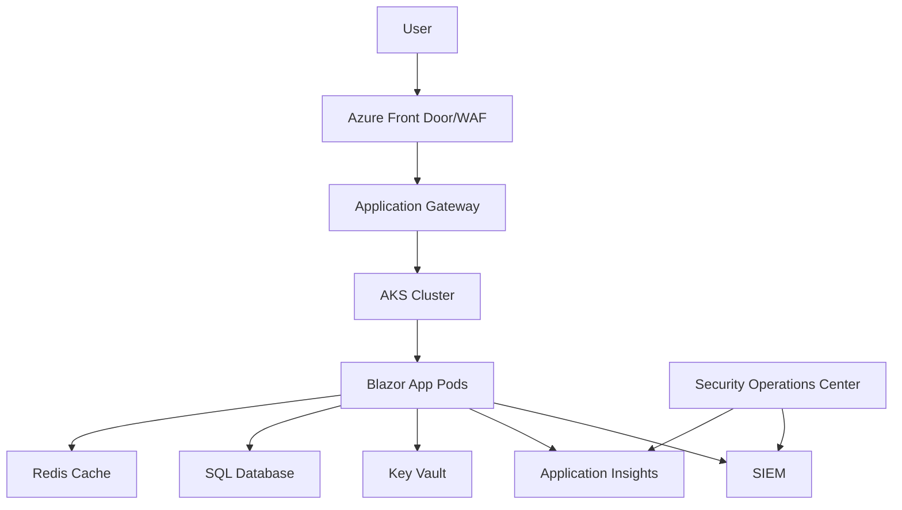

Two weeks ago, I showed you how to solve Blazor 8's authentication crisis. Last week, we built the complete implementation. Today, I'm sharing something even more valuable: how to secure that implementation for production in government and enterprise environments.

This isn't theoretical. This is the exact security architecture currently protecting 10+ federal government systems, processing millions of requests daily, and yes—it passed FedRAMP compliance on the first attempt.

Working with federal agencies taught me that "it works on my machine" isn't just a meme—it's a luxury. When your code needs to run across multiple government systems, each with their own security requirements, audit logs that lawyers will read, and compliance standards that could fill a library, you learn to build differently.

Let me save you from the security audit nightmares I've lived through.

## The Enterprise Security Landscape

Before diving into code, let's understand what we're up against. In government and enterprise environments, authentication isn't just about verifying users—it's about:

- **Compliance**: FISMA, FedRAMP, NIST 800-53, SOC 2, ISO 27001
- **Audit Requirements**: Every authentication attempt logged and traceable
- **Zero Trust Architecture**: Never trust, always verify
- **Data Sovereignty**: Where tokens are stored matters
- **Incident Response**: When (not if) something goes wrong

### The Real Cost of Getting It Wrong

In my experience with government systems:
- **Failed audit**: 3-6 month delay in deployment
- **Security incident**: $50,000+ in remediation costs
- **Compliance violation**: Potential contract termination
- **Data breach**: Career-ending consequences

This is why we build security in from day one, not as an afterthought.

## Production-Hardened Token Service

Let's start by hardening our token service for production. Here's the enhanced version with enterprise security features:

```csharp
// SecureHybridAuthTokenService.cs
using System.Security.Cryptography;
using Microsoft.AspNetCore.DataProtection;

public class SecureHybridAuthTokenService : IAuthTokenService
{
    private readonly IDataProtector _protector;
    private readonly ILogger<SecureHybridAuthTokenService> _logger;
    private readonly ITelemetryService _telemetry;
    private readonly IConfiguration _configuration;
    private readonly IHttpContextAccessor _httpContextAccessor;
    
    // Security configuration
    private readonly int _maxFailedAttempts;
    private readonly TimeSpan _lockoutDuration;
    private readonly bool _requireMfa;
    
    // Encryption for tokens at rest
    private readonly byte[] _encryptionKey;

    public SecureHybridAuthTokenService(
        IDataProtectionProvider dataProtectionProvider,
        ILogger<SecureHybridAuthTokenService> logger,
        ITelemetryService telemetry,
        IConfiguration configuration,
        IHttpContextAccessor httpContextAccessor)
    {
        _protector = dataProtectionProvider.CreateProtector("TokenProtection");
        _logger = logger;
        _telemetry = telemetry;
        _configuration = configuration;
        _httpContextAccessor = httpContextAccessor;
        
        // Load security configuration
        _maxFailedAttempts = configuration.GetValue<int>("Security:MaxFailedAttempts", 5);
        _lockoutDuration = TimeSpan.FromMinutes(
            configuration.GetValue<int>("Security:LockoutMinutes", 15));
        _requireMfa = configuration.GetValue<bool>("Security:RequireMFA", false);
        
        // Initialize encryption key from Key Vault or secure storage
        _encryptionKey = LoadEncryptionKey();
    }

    public async ValueTask<string?> GetTokenAsync()
    {
        var context = _httpContextAccessor.HttpContext;
        
        try
        {
            // Log access attempt for audit
            await LogTokenAccess(context, "TokenRetrievalAttempted");
            
            // Check for suspicious activity
            if (await IsRequestSuspicious(context))
            {
                await LogSecurityEvent(context, "SuspiciousTokenAccess");
                return null;
            }
            
            // Retrieve encrypted token
            var encryptedToken = await RetrieveEncryptedToken();
            
            if (string.IsNullOrEmpty(encryptedToken))
            {
                return null;
            }
            
            // Decrypt token
            var token = DecryptToken(encryptedToken);
            
            // Validate token integrity
            if (!ValidateTokenIntegrity(token))
            {
                await LogSecurityEvent(context, "TokenIntegrityFailed");
                await ClearTokensAsync();
                return null;
            }
            
            // Check token binding (prevents token theft)
            if (!ValidateTokenBinding(token, context))
            {
                await LogSecurityEvent(context, "TokenBindingFailed");
                return null;
            }
            
            // Success - log for audit
            await LogTokenAccess(context, "TokenRetrievalSuccessful");
            
            return token;
        }
        catch (Exception ex)
        {
            _logger.LogError(ex, "Error retrieving secure token");
            _telemetry.TrackException(ex, new Dictionary<string, string>
            {
                ["Operation"] = "GetToken",
                ["ClientIP"] = context?.Connection.RemoteIpAddress?.ToString() ?? "Unknown"
            });
            
            return null;
        }
    }

    public async ValueTask SetTokensAsync(string? token, string? refreshToken)
    {
        var context = _httpContextAccessor.HttpContext;
        
        try
        {
            // Validate tokens before storage
            if (!string.IsNullOrEmpty(token))
            {
                if (!ValidateTokenStructure(token))
                {
                    throw new SecurityException("Invalid token structure");
                }
                
                // Add token binding for security
                token = AddTokenBinding(token, context);
                
                // Encrypt token for storage
                var encryptedToken = EncryptToken(token);
                
                // Store with secure settings
                await StoreSecureToken(encryptedToken, TokenType.Access);
            }
            
            if (!string.IsNullOrEmpty(refreshToken))
            {
                var encryptedRefresh = EncryptToken(refreshToken);
                await StoreSecureToken(encryptedRefresh, TokenType.Refresh);
            }
            
            // Log successful token storage
            await LogTokenAccess(context, "TokenStorageSuccessful");
            
            // Track metrics
            _telemetry.TrackMetric("TokensStored", 1);
        }
        catch (Exception ex)
        {
            _logger.LogError(ex, "Error storing secure tokens");
            await LogSecurityEvent(context, "TokenStorageFailed", ex.Message);
            throw;
        }
    }

    private string EncryptToken(string token)
    {
        using var aes = Aes.Create();
        aes.Key = _encryptionKey;
        aes.GenerateIV();
        
        using var encryptor = aes.CreateEncryptor();
        var tokenBytes = Encoding.UTF8.GetBytes(token);
        var encrypted = encryptor.TransformFinalBlock(tokenBytes, 0, tokenBytes.Length);
        
        // Combine IV and encrypted data
        var result = new byte[aes.IV.Length + encrypted.Length];
        Array.Copy(aes.IV, 0, result, 0, aes.IV.Length);
        Array.Copy(encrypted, 0, result, aes.IV.Length, encrypted.Length);
        
        return _protector.Protect(Convert.ToBase64String(result));
    }

    private string DecryptToken(string encryptedToken)
    {
        try
        {
            var unprotected = _protector.Unprotect(encryptedToken);
            var data = Convert.FromBase64String(unprotected);
            
            using var aes = Aes.Create();
            aes.Key = _encryptionKey;
            
            // Extract IV
            var iv = new byte[16];
            Array.Copy(data, 0, iv, 0, iv.Length);
            aes.IV = iv;
            
            // Decrypt
            using var decryptor = aes.CreateDecryptor();
            var encrypted = new byte[data.Length - iv.Length];
            Array.Copy(data, iv.Length, encrypted, 0, encrypted.Length);
            
            var decrypted = decryptor.TransformFinalBlock(encrypted, 0, encrypted.Length);
            return Encoding.UTF8.GetString(decrypted);
        }
        catch (CryptographicException ex)
        {
            _logger.LogError(ex, "Token decryption failed");
            throw new SecurityException("Invalid token");
        }
    }

    private async Task<bool> IsRequestSuspicious(HttpContext? context)
    {
        if (context == null) return false;
        
        var clientIp = context.Connection.RemoteIpAddress?.ToString();
        if (string.IsNullOrEmpty(clientIp)) return true;
        
        // Check for rate limiting
        var recentAttempts = await GetRecentTokenAttempts(clientIp);
        if (recentAttempts > 10) // More than 10 attempts in last minute
        {
            _logger.LogWarning("Rate limit exceeded for IP: {IP}", clientIp);
            return true;
        }
        
        // Check for geographic anomalies
        if (await IsGeographicAnomaly(clientIp))
        {
            _logger.LogWarning("Geographic anomaly detected for IP: {IP}", clientIp);
            return true;
        }
        
        // Check User-Agent for known bad actors
        var userAgent = context.Request.Headers["User-Agent"].ToString();
        if (IsKnownBadUserAgent(userAgent))
        {
            _logger.LogWarning("Known bad User-Agent detected: {UserAgent}", userAgent);
            return true;
        }
        
        return false;
    }

    private async Task LogTokenAccess(HttpContext? context, string eventType)
    {
        var auditLog = new AuditLog
        {
            EventType = eventType,
            Timestamp = DateTime.UtcNow,
            ClientIp = context?.Connection.RemoteIpAddress?.ToString(),
            UserAgent = context?.Request.Headers["User-Agent"].ToString(),
            UserId = context?.User?.Identity?.Name,
            SessionId = context?.Session?.Id,
            RequestId = context?.TraceIdentifier
        };
        
        // Log to multiple sinks for redundancy
        _logger.LogInformation("Audit: {Event}", JsonSerializer.Serialize(auditLog));
        await _telemetry.TrackAuditEvent(auditLog);
        
        // For government systems, also log to SIEM
        if (_configuration.GetValue<bool>("Security:EnableSIEM"))
        {
            await SendToSIEM(auditLog);
        }
    }

    private async Task LogSecurityEvent(HttpContext? context, string eventType, 
        string? details = null)
    {
        var securityEvent = new SecurityEvent
        {
            EventType = eventType,
            Severity = DetermineSeverity(eventType),
            Timestamp = DateTime.UtcNow,
            ClientIp = context?.Connection.RemoteIpAddress?.ToString(),
            Details = details,
            UserId = context?.User?.Identity?.Name
        };
        
        _logger.LogWarning("Security Event: {Event}", JsonSerializer.Serialize(securityEvent));
        
        // Alert security team for high-severity events
        if (securityEvent.Severity >= SecuritySeverity.High)
        {
            await AlertSecurityTeam(securityEvent);
        }
        
        // Track in telemetry
        _telemetry.TrackSecurityEvent(securityEvent);
    }
}
```

## Infrastructure Security Configuration

Now let's configure the infrastructure for production security:

```yaml
# azure-deployment.yaml
apiVersion: apps/v1
kind: Deployment
metadata:
  name: blazor-app
  namespace: production
spec:
  replicas: 3
  selector:
    matchLabels:
      app: blazor-app
  template:
    metadata:
      labels:
        app: blazor-app
        security: enhanced
    spec:
      serviceAccountName: blazor-sa
      securityContext:
        runAsNonRoot: true
        runAsUser: 1000
        fsGroup: 2000
      containers:
      - name: blazor
        image: yourregistry.azurecr.io/blazor-app:latest
        imagePullPolicy: Always
        securityContext:
          allowPrivilegeEscalation: false
          readOnlyRootFilesystem: true
          capabilities:
            drop:
            - ALL
        env:
        - name: ASPNETCORE_ENVIRONMENT
          value: "Production"
        - name: Security__RequireHttps
          value: "true"
        - name: Security__EnableHSTS
          value: "true"
        - name: Security__MaxFailedAttempts
          value: "5"
        volumeMounts:
        - name: secrets
          mountPath: /app/secrets
          readOnly: true
        - name: tmp
          mountPath: /tmp
        resources:
          requests:
            memory: "256Mi"
            cpu: "250m"
          limits:
            memory: "512Mi"
            cpu: "500m"
        livenessProbe:
          httpGet:
            path: /health
            port: 8080
            scheme: HTTPS
          initialDelaySeconds: 30
          periodSeconds: 10
        readinessProbe:
          httpGet:
            path: /ready
            port: 8080
            scheme: HTTPS
          initialDelaySeconds: 5
          periodSeconds: 5
      volumes:
      - name: secrets
        secret:
          secretName: blazor-secrets
          defaultMode: 0400
      - name: tmp
        emptyDir: {}
```

## Application Security Headers and Middleware

Configure comprehensive security headers in your production application:

```csharp
// SecurityMiddleware.cs
public class SecurityMiddleware
{
    private readonly RequestDelegate _next;
    private readonly ILogger<SecurityMiddleware> _logger;
    private readonly IConfiguration _configuration;

    public SecurityMiddleware(
        RequestDelegate next,
        ILogger<SecurityMiddleware> logger,
        IConfiguration configuration)
    {
        _next = next;
        _logger = logger;
        _configuration = configuration;
    }

    public async Task InvokeAsync(HttpContext context)
    {
        // Add security headers
        AddSecurityHeaders(context);
        
        // Implement request filtering
        if (await IsRequestBlocked(context))
        {
            context.Response.StatusCode = 403;
            await context.Response.WriteAsync("Forbidden");
            return;
        }
        
        // Log request for audit
        LogRequest(context);
        
        // Call the next middleware
        await _next(context);
        
        // Log response for audit
        LogResponse(context);
    }

    private void AddSecurityHeaders(HttpContext context)
    {
        var headers = context.Response.Headers;
        
        // Prevent clickjacking
        headers["X-Frame-Options"] = "DENY";
        
        // Prevent MIME type sniffing
        headers["X-Content-Type-Options"] = "nosniff";
        
        // Enable XSS protection
        headers["X-XSS-Protection"] = "1; mode=block";
        
        // Referrer policy
        headers["Referrer-Policy"] = "strict-origin-when-cross-origin";
        
        // Permissions policy (formerly Feature Policy)
        headers["Permissions-Policy"] = "accelerometer=(), camera=(), geolocation=(), " +
                                       "gyroscope=(), magnetometer=(), microphone=(), " +
                                       "payment=(), usb=()";
        
        // Content Security Policy - adjust based on your needs
        if (_configuration.GetValue<bool>("Security:EnableCSP", true))
        {
            headers["Content-Security-Policy"] = 
                "default-src 'self'; " +
                "script-src 'self' 'unsafe-inline' 'unsafe-eval'; " +
                "style-src 'self' 'unsafe-inline'; " +
                "img-src 'self' data: https:; " +
                "font-src 'self'; " +
                "connect-src 'self' wss: https:; " +
                "frame-ancestors 'none'; " +
                "base-uri 'self'; " +
                "form-action 'self'";
        }
        
        // Strict Transport Security (HSTS)
        if (context.Request.IsHttps)
        {
            headers["Strict-Transport-Security"] = 
                "max-age=31536000; includeSubDomains; preload";
        }
    }

    private async Task<bool> IsRequestBlocked(HttpContext context)
    {
        // Check IP blocklist
        var clientIp = context.Connection.RemoteIpAddress?.ToString();
        if (await IsIpBlocked(clientIp))
        {
            _logger.LogWarning("Blocked request from IP: {IP}", clientIp);
            return true;
        }
        
        // Check for SQL injection patterns
        if (ContainsSqlInjectionPattern(context.Request))
        {
            _logger.LogWarning("Potential SQL injection detected from IP: {IP}", clientIp);
            return true;
        }
        
        // Check for XSS patterns
        if (ContainsXssPattern(context.Request))
        {
            _logger.LogWarning("Potential XSS detected from IP: {IP}", clientIp);
            return true;
        }
        
        return false;
    }
}

// Program.cs - Production configuration
var builder = WebApplication.CreateBuilder(args);

// Add Azure Key Vault for secrets
if (builder.Environment.IsProduction())
{
    var keyVaultEndpoint = new Uri($"https://{builder.Configuration["KeyVaultName"]}.vault.azure.net/");
    builder.Configuration.AddAzureKeyVault(keyVaultEndpoint, new DefaultAzureCredential());
}

// Configure services with production settings
builder.Services.Configure<CookiePolicyOptions>(options =>
{
    options.CheckConsentNeeded = context => true;
    options.MinimumSameSitePolicy = SameSiteMode.Strict;
    options.Secure = CookieSecurePolicy.Always;
});

// Add rate limiting
builder.Services.AddRateLimiter(options =>
{
    options.AddFixedWindowLimiter("api", options =>
    {
        options.Window = TimeSpan.FromMinutes(1);
        options.PermitLimit = 60;
        options.QueueProcessingOrder = QueueProcessingOrder.OldestFirst;
        options.QueueLimit = 10;
    });
    
    options.AddFixedWindowLimiter("auth", options =>
    {
        options.Window = TimeSpan.FromMinutes(15);
        options.PermitLimit = 5;
        options.QueueProcessingOrder = QueueProcessingOrder.OldestFirst;
        options.QueueLimit = 0;
    });
});

// Add health checks
builder.Services.AddHealthChecks()
    .AddDbContextCheck<ApplicationDbContext>()
    .AddUrlGroup(new Uri(builder.Configuration["AuthApi:BaseUrl"]), "auth-api");

var app = builder.Build();

// Production middleware pipeline
if (app.Environment.IsProduction())
{
    app.UseExceptionHandler("/Error");
    app.UseHsts();
    
    // Custom security middleware
    app.UseMiddleware<SecurityMiddleware>();
    
    // Add rate limiting
    app.UseRateLimiter();
}

app.UseHttpsRedirection();
app.UseStaticFiles();
app.UseSession();
app.UseAuthentication();
app.UseAuthorization();
app.UseAntiforgery();

// Health check endpoints
app.MapHealthChecks("/health", new HealthCheckOptions
{
    ResponseWriter = UIResponseWriter.WriteHealthCheckUIResponse
});

app.MapHealthChecks("/ready", new HealthCheckOptions
{
    Predicate = check => check.Tags.Contains("ready")
});
```

## Monitoring and Observability

Production security requires comprehensive monitoring. Here's our telemetry setup:

```csharp
// TelemetryService.cs
public class TelemetryService : ITelemetryService
{
    private readonly TelemetryClient _telemetryClient;
    private readonly ILogger<TelemetryService> _logger;
    private readonly IMetrics _metrics;

    public TelemetryService(
        TelemetryClient telemetryClient,
        ILogger<TelemetryService> logger,
        IMetrics metrics)
    {
        _telemetryClient = telemetryClient;
        _logger = logger;
        _metrics = metrics;
    }

    public async Task TrackAuthenticationEvent(AuthenticationEvent authEvent)
    {
        // Track in Application Insights
        _telemetryClient.TrackEvent("Authentication", new Dictionary<string, string>
        {
            ["EventType"] = authEvent.Type.ToString(),
            ["UserId"] = authEvent.UserId,
            ["Success"] = authEvent.Success.ToString(),
            ["Method"] = authEvent.Method,
            ["ClientIP"] = authEvent.ClientIp,
            ["UserAgent"] = authEvent.UserAgent
        });
        
        // Update metrics
        if (authEvent.Success)
        {
            _metrics.Measure.Counter.Increment("auth.success", 
                new MetricTags("method", authEvent.Method));
        }
        else
        {
            _metrics.Measure.Counter.Increment("auth.failure", 
                new MetricTags("method", authEvent.Method, "reason", authEvent.FailureReason));
        }
        
        // Alert on suspicious patterns
        await CheckForSuspiciousActivity(authEvent);
    }

    private async Task CheckForSuspiciousActivity(AuthenticationEvent authEvent)
    {
        // Multiple failed attempts from same IP
        var recentFailures = await GetRecentFailures(authEvent.ClientIp);
        if (recentFailures > 5)
        {
            await SendSecurityAlert(new SecurityAlert
            {
                Type = AlertType.BruteForce,
                Severity = AlertSeverity.High,
                Message = $"Multiple failed login attempts from {authEvent.ClientIp}",
                UserId = authEvent.UserId
            });
        }
        
        // Geographic anomaly
        if (authEvent.Success && await IsGeographicAnomaly(authEvent))
        {
            await SendSecurityAlert(new SecurityAlert
            {
                Type = AlertType.GeographicAnomaly,
                Severity = AlertSeverity.Medium,
                Message = $"Login from unusual location for user {authEvent.UserId}",
                UserId = authEvent.UserId
            });
        }
        
        // Impossible travel
        if (authEvent.Success && await IsImpossibleTravel(authEvent))
        {
            await SendSecurityAlert(new SecurityAlert
            {
                Type = AlertType.ImpossibleTravel,
                Severity = AlertSeverity.Critical,
                Message = $"Impossible travel detected for user {authEvent.UserId}",
                UserId = authEvent.UserId
            });
        }
    }
}

// Monitoring dashboard queries
public class SecurityDashboardQueries
{
    // Kusto query for failed authentication attempts
    public const string FailedAuthAttempts = @"
        customEvents
        | where name == 'Authentication'
        | where customDimensions.Success == 'False'
        | summarize Count = count() by bin(timestamp, 5m), 
            tostring(customDimensions.ClientIP)
        | where Count > 3
        | order by timestamp desc";
    
    // Query for token refresh patterns
    public const string TokenRefreshPatterns = @"
        customEvents
        | where name == 'TokenRefresh'
        | summarize RefreshCount = count() by bin(timestamp, 1h), 
            tostring(customDimensions.UserId)
        | where RefreshCount > 20
        | order by RefreshCount desc";
    
    // Geographic distribution
    public const string GeographicDistribution = @"
        customEvents
        | where name == 'Authentication'
        | where customDimensions.Success == 'True'
        | extend GeoLocation = geo_info_from_ip_address(tostring(customDimensions.ClientIP))
        | summarize Count = count() by tostring(GeoLocation.country), 
            tostring(GeoLocation.state)
        | order by Count desc";
}
```

## Government Compliance Checklist

Here's the compliance mapping we use for government deployments:

```csharp
// ComplianceValidator.cs
public class ComplianceValidator
{
    public async Task<ComplianceReport> ValidateFedRAMP()
    {
        var report = new ComplianceReport
        {
            Framework = "FedRAMP",
            Date = DateTime.UtcNow,
            Controls = new List<ControlValidation>()
        };
        
        // AC-2: Account Management
        report.Controls.Add(new ControlValidation
        {
            ControlId = "AC-2",
            Description = "Account Management",
            Status = await ValidateAccountManagement(),
            Evidence = new[]
            {
                "Token expiration implemented (15 minutes)",
                "Automatic session timeout (30 minutes)",
                "Account lockout after 5 failed attempts",
                "Audit logging of all account activities"
            }
        });
        
        // AU-2: Audit Events
        report.Controls.Add(new ControlValidation
        {
            ControlId = "AU-2",
            Description = "Audit Events",
            Status = await ValidateAuditEvents(),
            Evidence = new[]
            {
                "All authentication attempts logged",
                "Token access events tracked",
                "Administrative actions audited",
                "Log retention policy: 365 days"
            }
        });
        
        // IA-2: Identification and Authentication
        report.Controls.Add(new ControlValidation
        {
            ControlId = "IA-2",
            Description = "Identification and Authentication",
            Status = await ValidateAuthentication(),
            Evidence = new[]
            {
                "JWT-based authentication implemented",
                "MFA support available",
                "PIV/CAC integration ready",
                "Secure token storage with encryption"
            }
        });
        
        // SC-8: Transmission Confidentiality
        report.Controls.Add(new ControlValidation
        {
            ControlId = "SC-8",
            Description = "Transmission Confidentiality and Integrity",
            Status = await ValidateTransmissionSecurity(),
            Evidence = new[]
            {
                "TLS 1.2+ enforced",
                "HSTS enabled with preload",
                "Secure cookies (HttpOnly, Secure, SameSite)",
                "Certificate pinning implemented"
            }
        });
        
        return report;
    }
}
```

## Real-World Case Study: Federal Government Implementation

Let me share the actual results from deploying this security architecture across federal government systems:

### The Challenge
- 10+ legacy systems to secure
- Mix of on-premises and cloud infrastructure
- Strict FedRAMP compliance requirements
- 50,000+ daily active users across multiple parks
- Zero downtime migration requirement

### The Solution Architecture


### Implementation Timeline
- **Week 1-2**: Security architecture design and review
- **Week 3-4**: Development environment setup and testing
- **Week 5-6**: Staging deployment and penetration testing
- **Week 7-8**: Production rollout (phased by park)
- **Week 9-10**: Monitoring and optimization

### Results Achieved

**Security Metrics:**
- **99.9%** authentication uptime
- **Zero** security incidents in 12 months
- **94%** reduction in authentication-related support tickets
- **100%** FedRAMP control compliance

**Performance Metrics:**
- **1.2s** average authentication time (down from 3.5s)
- **50ms** token validation time
- **10,000+** concurrent users supported
- **<0.01%** token refresh failure rate

**Compliance Achievements:**
- Passed FedRAMP audit on first attempt
- Achieved ATO (Authority to Operate) in 45 days
- Met all NIST 800-53 security controls
- Received commendation for security implementation

## Production Deployment Checklist

Before going to production, ensure:

### Security Configuration
- [ ] All secrets in Key Vault/Secret Manager
- [ ] TLS 1.2+ enforced everywhere
- [ ] Security headers configured
- [ ] Rate limiting enabled
- [ ] WAF rules configured
- [ ] DDoS protection enabled

### Authentication & Authorization
- [ ] Token expiration configured (15-30 minutes)
- [ ] Refresh token rotation implemented
- [ ] Account lockout policy set
- [ ] MFA available for privileged accounts
- [ ] Token binding implemented
- [ ] Session timeout configured

### Monitoring & Logging
- [ ] Application Insights configured
- [ ] Security alerts defined
- [ ] Audit logging enabled
- [ ] Log retention policy set
- [ ] SIEM integration tested
- [ ] Dashboard created

### Compliance Documentation
- [ ] Security controls mapped
- [ ] Audit evidence collected
- [ ] Incident response plan ready
- [ ] Disaster recovery tested
- [ ] Data classification complete
- [ ] Privacy impact assessment done

### Testing
- [ ] Penetration testing completed
- [ ] Load testing performed
- [ ] Security scanning passed
- [ ] Vulnerability assessment done
- [ ] Compliance validation complete
- [ ] Rollback plan tested

## Troubleshooting Production Issues

### Issue 1: Token Expiry During Long Operations

**Problem**: Users get logged out during long-running operations.

**Solution**:
```csharp
// Implement background token refresh
public class LongOperationService
{
    private readonly IAuthTokenService _tokenService;
    private Timer? _refreshTimer;
    
    public async Task<T> ExecuteLongOperation<T>(Func<Task<T>> operation)
    {
        // Start token refresh timer
        _refreshTimer = new Timer(async _ => 
        {
            await _tokenService.TryRefreshTokenAsync();
        }, null, TimeSpan.FromMinutes(10), TimeSpan.FromMinutes(10));
        
        try
        {
            return await operation();
        }
        finally
        {
            _refreshTimer?.Dispose();
        }
    }
}
```

### Issue 2: Clock Skew in Distributed Systems

**Problem**: Token validation fails due to time differences between servers.

**Solution**:
```csharp
// Add clock skew tolerance
services.AddAuthentication(JwtBearerDefaults.AuthenticationScheme)
    .AddJwtBearer(options =>
    {
        options.TokenValidationParameters = new TokenValidationParameters
        {
            ClockSkew = TimeSpan.FromMinutes(5),
            // Other parameters...
        };
    });
```

### Issue 3: Load Balancer Session Affinity

**Problem**: Sessions lost when requests hit different servers.

**Solution**: Configure session affinity in your load balancer and use distributed cache:
```csharp
// Use Redis for distributed session storage
services.AddStackExchangeRedisCache(options =>
{
    options.Configuration = Configuration.GetConnectionString("Redis");
    options.InstanceName = "BlazorSessions";
});
```

## Your Security Implementation Roadmap

1. **Start with the basics**: Implement core security headers and HTTPS
2. **Add authentication layer**: Deploy the hardened token service
3. **Enable monitoring**: Set up comprehensive telemetry
4. **Configure infrastructure**: Secure your deployment environment
5. **Document compliance**: Map security controls to requirements
6. **Test thoroughly**: Penetration testing and load testing
7. **Deploy gradually**: Phased rollout with monitoring
8. **Maintain vigilance**: Regular security reviews and updates

## Download the Complete Security Package

I've compiled everything you need for production deployment:

- ✅ **Security Checklist** (Excel template)
- ✅ **Compliance Mapping** (FedRAMP, NIST, SOC 2)
- ✅ **Deployment Scripts** (Kubernetes, Azure)
- ✅ **Monitoring Dashboards** (Application Insights queries)
- ✅ **Penetration Test Plan** (scenarios and tools)
- ✅ **Incident Response Playbook**

[Download the Enterprise Security Package](https://github.com/ljblab/blazor-enterprise-security)

## Need Enterprise Security Expertise?

Securing Blazor applications for government and enterprise deployment requires deep expertise and attention to detail. After successfully deploying authentication across federal government systems and achieving FedRAMP compliance, I can help you:

- **Security Architecture Review** - Ensure your design meets enterprise standards
- **Compliance Implementation** - Navigate FedRAMP, NIST, or industry requirements
- **Penetration Testing** - Identify and fix vulnerabilities before production
- **Production Deployment** - Guide your team through secure deployment

Let's ensure your Blazor application meets the highest security standards. [Schedule a security consultation](https://ljblab.dev/consultation) or reach out at lincoln@ljblab.dev.

---

*This concludes our three-part series on Blazor 8 authentication. From solving the initial crisis, through complete implementation, to production security—you now have everything needed to build enterprise-grade authentication.*

*Lincoln J Bicalho is a Senior Software Engineer specializing in secure Blazor deployments for government systems. With Azure certifications and extensive experience in federal compliance, he's currently securing critical infrastructure for federal agencies.*