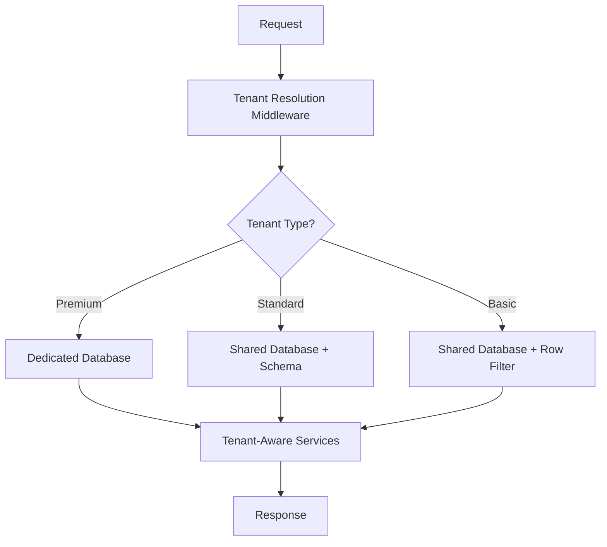

In [Part 1](/building-multi-tenant-blazor-applications-that-scale), we explored why the standard multi-tenant approaches fail at scale. After three spectacular failures, we discovered the key insight: different tenants have different isolation requirements.

Today, we're diving into the complete implementation of our hybrid multi-tenant architecture that handles high-volume production traffic with robust data isolation for SaaS platforms.

## The Solution: Hybrid Isolation That Actually Scales

After recognizing that tenants need different isolation levels, here's the architecture that emerged:



This hybrid approach allows us to:
- **Premium tenants** get dedicated databases for maximum isolation
- **Standard tenants** share databases but have separate schemas
- **Basic tenants** use row-level security for cost efficiency
- **All tenants** get seamless service regardless of their tier

## Step 1: Intelligent Tenant Resolution

First, we need rock-solid tenant identification that works across multiple strategies:

```csharp
public class TenantResolutionMiddleware
{
    private readonly RequestDelegate _next;
    private readonly ITenantService _tenantService;
    private readonly ILogger<TenantResolutionMiddleware> _logger;

    public async Task InvokeAsync(HttpContext context)
    {
        try
        {
            var tenant = await ResolveTenantAsync(context);
            
            if (tenant == null)
            {
                context.Response.StatusCode = 400;
                await context.Response.WriteAsync("Tenant identification required");
                return;
            }

            // Critical: Set tenant context for the entire request pipeline
            _tenantService.SetTenant(tenant);
            
            // Add tenant info to logging context
            using (_logger.BeginScope(new Dictionary<string, object>
            {
                ["TenantId"] = tenant.Id,
                ["TenantName"] = tenant.Name
            }))
            {
                await _next(context);
            }
        }
        finally
        {
            // Critical: Clear tenant context to prevent bleeding
            _tenantService.ClearTenant();
        }
    }

    private async Task<Tenant?> ResolveTenantAsync(HttpContext context)
    {
        // Strategy 1: Subdomain (app.tenant1.com)
        var host = context.Request.Host.Host;
        var subdomain = host.Split('.').FirstOrDefault();
        
        if (!string.IsNullOrEmpty(subdomain) && subdomain != "app")
        {
            return await _tenantService.GetBySubdomainAsync(subdomain);
        }

        // Strategy 2: Header (for API calls)
        if (context.Request.Headers.TryGetValue("X-Tenant-ID", out var tenantId))
        {
            return await _tenantService.GetByIdAsync(tenantId);
        }

        // Strategy 3: Route parameter (/tenant/{tenantId}/...)
        if (context.Request.RouteValues.TryGetValue("tenantId", out var routeTenantId))
        {
            return await _tenantService.GetByIdAsync(routeTenantId.ToString());
        }

        // Strategy 4: JWT Claim
        if (context.User.Identity?.IsAuthenticated == true)
        {
            var tenantClaim = context.User.FindFirst("tenant_id");
            if (tenantClaim != null)
            {
                return await _tenantService.GetByIdAsync(tenantClaim.Value);
            }
        }

        return null;
    }
}
```

The key is having multiple fallback strategies and **always** clearing the tenant context to prevent data bleeding between requests.

## Step 2: Dynamic Database Context with Isolation Levels

Here's where the magic happens—different isolation strategies based on tenant tier:

```csharp
public class MultiTenantDbContext : DbContext
{
    private readonly ITenantService _tenantService;
    private readonly IConfiguration _configuration;
    private readonly ILogger<MultiTenantDbContext> _logger;
    
    public MultiTenantDbContext(
        DbContextOptions<MultiTenantDbContext> options,
        ITenantService tenantService,
        IConfiguration configuration,
        ILogger<MultiTenantDbContext> logger) : base(options)
    {
        _tenantService = tenantService;
        _configuration = configuration;
        _logger = logger;
    }

    protected override void OnConfiguring(DbContextOptionsBuilder optionsBuilder)
    {
        var tenant = _tenantService.GetCurrentTenant();
        
        if (tenant == null)
        {
            throw new InvalidOperationException("No tenant context available");
        }

        // Dynamic connection string based on tenant tier
        var connectionString = GetTenantConnectionString(tenant);
        
        optionsBuilder.UseSqlServer(connectionString, options =>
        {
            options.EnableRetryOnFailure(3);
            options.CommandTimeout(30);
            
            // Use different isolation levels based on tenant requirements
            if (tenant.RequiresHighIsolation)
            {
                options.UseQuerySplittingBehavior(QuerySplittingBehavior.SingleQuery);
            }
        });

        // Add interceptors for audit logging
        optionsBuilder.AddInterceptors(new TenantAuditInterceptor(tenant));
    }

    protected override void OnModelCreating(ModelBuilder modelBuilder)
    {
        var tenant = _tenantService.GetCurrentTenant();
        
        // Apply schema based on tenant tier
        if (tenant.Tier == TenantTier.Premium)
        {
            modelBuilder.HasDefaultSchema($"tenant_{tenant.Id}");
        }
        else
        {
            modelBuilder.HasDefaultSchema("shared");
        }

        // Apply global query filters for row-level security
        foreach (var entityType in modelBuilder.Model.GetEntityTypes())
        {
            if (typeof(ITenantEntity).IsAssignableFrom(entityType.ClrType))
            {
                var method = typeof(MultiTenantDbContext)
                    .GetMethod(nameof(GetTenantFilter), BindingFlags.NonPublic | BindingFlags.Static)
                    ?.MakeGenericMethod(entityType.ClrType);
                    
                var filter = method?.Invoke(null, new object[] { tenant.Id });
                
                if (filter != null)
                {
                    modelBuilder.Entity(entityType.ClrType).HasQueryFilter((LambdaExpression)filter);
                }
            }
        }

        base.OnModelCreating(modelBuilder);
    }

    private static Expression<Func<T, bool>> GetTenantFilter<T>(Guid tenantId) where T : ITenantEntity
    {
        return entity => entity.TenantId == tenantId;
    }

    private string GetTenantConnectionString(Tenant tenant)
    {
        return tenant.Tier switch
        {
            TenantTier.Premium => GetPremiumConnectionString(tenant),
            TenantTier.Standard => GetStandardConnectionString(tenant),
            TenantTier.Basic => GetBasicConnectionString(),
            _ => throw new NotSupportedException($"Tenant tier {tenant.Tier} not supported")
        };
    }

    private string GetPremiumConnectionString(Tenant tenant)
    {
        // Premium tenants get their own database
        var baseConnection = _configuration.GetConnectionString("PremiumBase");
        return baseConnection.Replace("{database}", $"TenantDB_{tenant.Id}");
    }

    private string GetStandardConnectionString(Tenant tenant)
    {
        // Standard tenants share databases but get their own schema
        var shardKey = GetShardKey(tenant.Id);
        return _configuration.GetConnectionString($"StandardShard_{shardKey}");
    }

    private string GetBasicConnectionString()
    {
        // Basic tenants share everything with row-level security
        return _configuration.GetConnectionString("SharedDatabase");
    }

    private int GetShardKey(Guid tenantId)
    {
        // Distribute standard tenants across 4 database shards
        return Math.Abs(tenantId.GetHashCode()) % 4;
    }
}
```

## Step 3: Intelligent Caching Strategy

One of the biggest challenges in multi-tenant applications is caching. Here's how to do it right:

```csharp
public class TenantAwareCacheService : ICacheService
{
    private readonly IMemoryCache _memoryCache;
    private readonly IDistributedCache _distributedCache;
    private readonly ITenantService _tenantService;
    private readonly ILogger<TenantAwareCacheService> _logger;
    private readonly Dictionary<Guid, long> _tenantMemoryUsage = new();
    private readonly SemaphoreSlim _usageLock = new(1, 1);

    public async Task<T?> GetAsync<T>(string key, CancellationToken cancellationToken = default)
    {
        var tenant = _tenantService.GetCurrentTenant();
        var tenantKey = BuildTenantKey(tenant, key);
        
        // Try memory cache first (L1)
        if (_memoryCache.TryGetValue(tenantKey, out T cachedValue))
        {
            _logger.LogDebug("Cache hit (memory) for key: {Key}", tenantKey);
            return cachedValue;
        }

        // Try distributed cache (L2)
        var distributedValue = await _distributedCache.GetAsync(tenantKey, cancellationToken);
        if (distributedValue != null)
        {
            var deserializedValue = JsonSerializer.Deserialize<T>(distributedValue);
            
            // Populate memory cache for faster subsequent access
            await SetMemoryCacheAsync(tenant, key, deserializedValue);
            
            _logger.LogDebug("Cache hit (distributed) for key: {Key}", tenantKey);
            return deserializedValue;
        }

        _logger.LogDebug("Cache miss for key: {Key}", tenantKey);
        return default;
    }

    public async Task SetAsync<T>(string key, T value, TimeSpan? expiration = null, CancellationToken cancellationToken = default)
    {
        var tenant = _tenantService.GetCurrentTenant();
        
        // Check tenant cache quota
        if (!await CheckTenantQuotaAsync(tenant, value))
        {
            _logger.LogWarning("Tenant {TenantId} exceeded cache quota", tenant.Id);
            
            // Evict least recently used items for this tenant
            await EvictTenantCacheAsync(tenant);
        }

        var tenantKey = BuildTenantKey(tenant, key);
        var options = new DistributedCacheEntryOptions
        {
            SlidingExpiration = expiration ?? GetDefaultExpiration(tenant)
        };

        // Set in distributed cache
        var serialized = JsonSerializer.SerializeToUtf8Bytes(value);
        await _distributedCache.SetAsync(tenantKey, serialized, options, cancellationToken);

        // Set in memory cache
        await SetMemoryCacheAsync(tenant, key, value, expiration);
        
        _logger.LogDebug("Cache set for key: {Key}", tenantKey);
    }

    private string BuildTenantKey(Tenant tenant, string key)
    {
        // Include tenant ID and tier in cache key for complete isolation
        return $"tenant:{tenant.Id}:{tenant.Tier}:{key}";
    }

    private async Task<bool> CheckTenantQuotaAsync(Tenant tenant, object value)
    {
        // Estimate object size
        var size = EstimateObjectSize(value);
        
        await _usageLock.WaitAsync();
        try
        {
            if (!_tenantMemoryUsage.ContainsKey(tenant.Id))
            {
                _tenantMemoryUsage[tenant.Id] = 0;
            }

            var currentUsage = _tenantMemoryUsage[tenant.Id];
            var maxUsage = GetTenantMaxCacheSize(tenant);
            
            if (currentUsage + size > maxUsage)
            {
                return false;
            }

            _tenantMemoryUsage[tenant.Id] = currentUsage + size;
            return true;
        }
        finally
        {
            _usageLock.Release();
        }
    }

    private long GetTenantMaxCacheSize(Tenant tenant)
    {
        return tenant.Tier switch
        {
            TenantTier.Premium => 500 * 1024 * 1024,  // 500 MB
            TenantTier.Standard => 100 * 1024 * 1024, // 100 MB
            TenantTier.Basic => 20 * 1024 * 1024,     // 20 MB
            _ => 10 * 1024 * 1024                     // 10 MB default
        };
    }

    private TimeSpan GetDefaultExpiration(Tenant tenant)
    {
        return tenant.Tier switch
        {
            TenantTier.Premium => TimeSpan.FromHours(24),
            TenantTier.Standard => TimeSpan.FromHours(4),
            TenantTier.Basic => TimeSpan.FromHours(1),
            _ => TimeSpan.FromMinutes(30)
        };
    }
}
```

## Step 4: Security Boundaries and Authorization

Preventing cross-tenant access is critical. Here's our authorization handler:

```csharp
public class TenantAuthorizationHandler : AuthorizationHandler<TenantRequirement>
{
    private readonly ITenantService _tenantService;
    private readonly ILogger<TenantAuthorizationHandler> _logger;

    protected override Task HandleRequirementAsync(
        AuthorizationHandlerContext context,
        TenantRequirement requirement)
    {
        var currentTenant = _tenantService.GetCurrentTenant();
        
        if (currentTenant == null)
        {
            _logger.LogWarning("No tenant context available for authorization");
            context.Fail();
            return Task.CompletedTask;
        }

        // Check if user belongs to the current tenant
        var userTenantClaim = context.User.FindFirst("tenant_id");
        if (userTenantClaim == null)
        {
            _logger.LogWarning("User has no tenant claim");
            context.Fail();
            return Task.CompletedTask;
        }

        if (userTenantClaim.Value != currentTenant.Id.ToString())
        {
            _logger.LogError(
                "Cross-tenant access attempt! User tenant: {UserTenant}, Current tenant: {CurrentTenant}",
                userTenantClaim.Value, 
                currentTenant.Id);
            
            // This is a serious security event - trigger alerts
            RaiseSecurityAlert(context.User, currentTenant, userTenantClaim.Value);
            
            context.Fail();
            return Task.CompletedTask;
        }

        // Additional checks for admin operations
        if (requirement.RequiresAdminAccess)
        {
            var isAdmin = context.User.IsInRole($"TenantAdmin_{currentTenant.Id}") ||
                         context.User.IsInRole("SuperAdmin");
            
            if (!isAdmin)
            {
                _logger.LogWarning("User lacks admin access for tenant: {TenantId}", currentTenant.Id);
                context.Fail();
                return Task.CompletedTask;
            }
        }

        // Check resource-level permissions if applicable
        if (context.Resource != null && context.Resource is ITenantResource resource)
        {
            if (resource.TenantId != currentTenant.Id)
            {
                _logger.LogError(
                    "Resource tenant mismatch! Resource tenant: {ResourceTenant}, Current tenant: {CurrentTenant}",
                    resource.TenantId, 
                    currentTenant.Id);
                
                context.Fail();
                return Task.CompletedTask;
            }
        }

        context.Succeed(requirement);
        return Task.CompletedTask;
    }

    private void RaiseSecurityAlert(ClaimsPrincipal user, Tenant currentTenant, string attemptedTenantId)
    {
        // In production, this triggers:
        // - Email to security team
        // - Slack/Teams notification
        // - Security audit log entry
        // - Potential account lockout
        
        var alert = new SecurityAlert
        {
            Type = SecurityAlertType.CrossTenantAccess,
            Severity = SecuritySeverity.Critical,
            UserId = user.FindFirst(ClaimTypes.NameIdentifier)?.Value,
            CurrentTenantId = currentTenant.Id,
            AttemptedTenantId = attemptedTenantId,
            Timestamp = DateTime.UtcNow,
            IpAddress = GetUserIpAddress(),
            UserAgent = GetUserAgent()
        };

        // Log to security audit system
        _securityAuditService.LogSecurityAlert(alert);
    }
}
```

## The Complete Startup Configuration

Here's how to wire everything together:

```csharp
public class Program
{
    public static void Main(string[] args)
    {
        var builder = WebApplication.CreateBuilder(args);

        // Add multi-tenant services
        builder.Services.AddMultiTenancy()
            .WithResolutionStrategy<SubdomainResolutionStrategy>()
            .WithStore<DatabaseTenantStore>()
            .WithPerTenantServices(services =>
            {
                services.AddScoped<IEmailService, TenantEmailService>();
                services.AddScoped<IStorageService, TenantStorageService>();
            });

        // Configure database with tenant awareness
        builder.Services.AddDbContext<MultiTenantDbContext>((serviceProvider, options) =>
        {
            var tenantService = serviceProvider.GetRequiredService<ITenantService>();
            var tenant = tenantService.GetCurrentTenant();
            
            if (tenant != null)
            {
                options.UseSqlServer(GetConnectionString(tenant));
            }
        });

        // Add tenant-aware caching
        builder.Services.AddMemoryCache();
        builder.Services.AddStackExchangeRedisCache(options =>
        {
            options.Configuration = "localhost:6379";
            options.InstanceName = "MultiTenant";
        });
        builder.Services.AddSingleton<ICacheService, TenantAwareCacheService>();

        // Add authorization with tenant policies
        builder.Services.AddAuthorization(options =>
        {
            options.AddPolicy("TenantAccess", policy =>
            {
                policy.Requirements.Add(new TenantRequirement());
            });
            
            options.AddPolicy("TenantAdmin", policy =>
            {
                policy.Requirements.Add(new TenantRequirement { RequiresAdminAccess = true });
            });
        });

        var app = builder.Build();

        // Add tenant resolution middleware early in pipeline
        app.UseMiddleware<TenantResolutionMiddleware>();

        // Standard middleware
        app.UseAuthentication();
        app.UseAuthorization();

        app.MapControllers().RequireAuthorization("TenantAccess");

        app.Run();
    }
}
```

## What We've Built

This hybrid architecture gives us:

✅ **Flexible isolation levels** based on tenant needs  
✅ **Automatic tenant resolution** across multiple strategies  
✅ **Intelligent caching** with per-tenant quotas  
✅ **Bulletproof security** with cross-tenant access prevention  
✅ **Zero configuration deployment** - everything adapts automatically  

## Coming Up in Part 3

In our final article, we'll share the production battle stories that shaped this architecture:

- **Performance insights** from production experience
- **The hidden challenges** that nearly broke our system (async context bleeding, connection pool exhaustion)
- **Migration strategies** for deploying across tenants
- **Real case study** from our federal government deployment
- **Common pitfalls** and when NOT to use multi-tenancy

We'll also cover the complete startup configuration and share the performance monitoring tools that help maintain high system availability.

---

## Series Navigation

- **Part 1**: [The Foundation and Fatal Flaws](/building-multi-tenant-blazor-applications-that-scale) ← *Previous*
- **Part 2**: The Hybrid Solution That Works ← *You are here*
- **Part 3**: [Battle-Tested Production Insights](/building-multi-tenant-blazor-applications-that-scale-part-3) → *Coming October 21*

---

*Lincoln J Bicalho is a Senior Software Engineer specializing in Blazor and enterprise architectures. With extensive experience in federal government systems, he's currently building multi-tenant solutions that serve thousands of users daily.*

**Need help implementing this architecture?** [Get in touch](https://ljblab.dev/contact) for a consultation on your specific multi-tenant requirements.